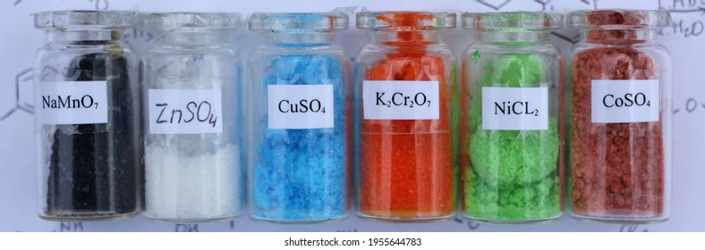
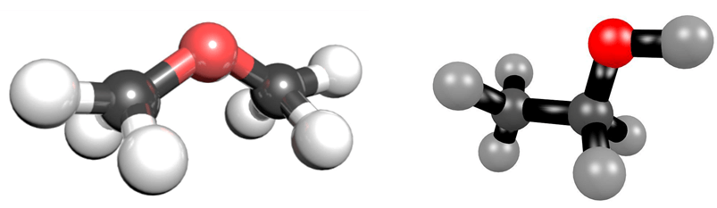

# hoa hoc
# Hóa học thú vị như thế nào?

  
**_Made by Nei_**  

## Giới thiệu  
Trang web này được tạo ra để nói đến sự thú vị của môn Hóa. Môn Hóa không nhàm chán như lý thuyết sách giáo khoa mà còn chứa đầy sự thực tiễn xung quanh chúng ta. Hóa học giúp giải đáp nhiều câu hỏi thú vị như tại sao mỗi loại quả có mùi hương khác nhau hay tại sao người ta chưng cất tinh bột sau khi thủy phân và lên men lại thu được rượu. Cùng khám phá các điều thú vị của Hóa học bên dưới nhé!  

---

## Nội dung chính  
- [Giới thiệu](#giới-thiệu)  
- [Nguyên tố hóa học](#nguyên-tố-hóa-học)  
- [Hợp chất hóa học](#hợp-chất-hóa-học)  
- [Hóa học xung quanh](#hóa-học-xung-quanh)  
- [Nhà hóa học](#nhà-hóa-học)  
- [Góc tương tác](#góc-tương-tác)  

---

## Nguyên tố hóa học  

### Bảng tuần hoàn hóa học  
Trước hết, nhắc đến Hóa học không thể nào thiếu hình ảnh về bảng tuần hoàn của nhà bác học người Nga Dmitri Ivanovich Mendeleev. Bảng tuần hoàn chứa đựng 118 nguyên tố hóa học cùng với ứng dụng của từng nguyên tố:  

  

*Nguồn: Keith Enevoldsen*  
[Tìm hiểu thêm về bảng tuần hoàn](https://elements.wlonk.com/Elements_Pics+Words_11x8.5.pdf)  

---

## Hợp chất hóa học  

Hợp chất hóa học là các chất được cấu tạo từ 2 nguyên tố khác loại trở lên, với tỉ lệ thành phần cố định và trật tự nhất định.  

### Hợp chất vô cơ  
Bao gồm các chất như khí carbon monoxide, khí carbonic, và các muối carbonate, hydrocarbonate.  

  

[Tìm hiểu thêm về hợp chất vô cơ](https://labvietchem.com.vn/tin-tuc/hop-chat-vo-co-la-gi.html)  

### Hợp chất hữu cơ  
Là lớp lớn các hợp chất chứa carbon, ngoại trừ carbide, carbonate, và cyanide.  

  

[Tìm hiểu thêm về hợp chất hữu cơ](https://glawvn.com/cac-hop-chat-huu-co-la-gi-5-ung-dung-thuong-gap/)  

---

## Hóa học xung quanh  

Hãy xem video dưới đây về **Top 10 hiện tượng hóa học thú vị trong cuộc sống** để thấy hóa học ý nghĩa như thế nào nhé!  

```html
<video src="video.mp4" controls>Video không được hỗ trợ.</video>

